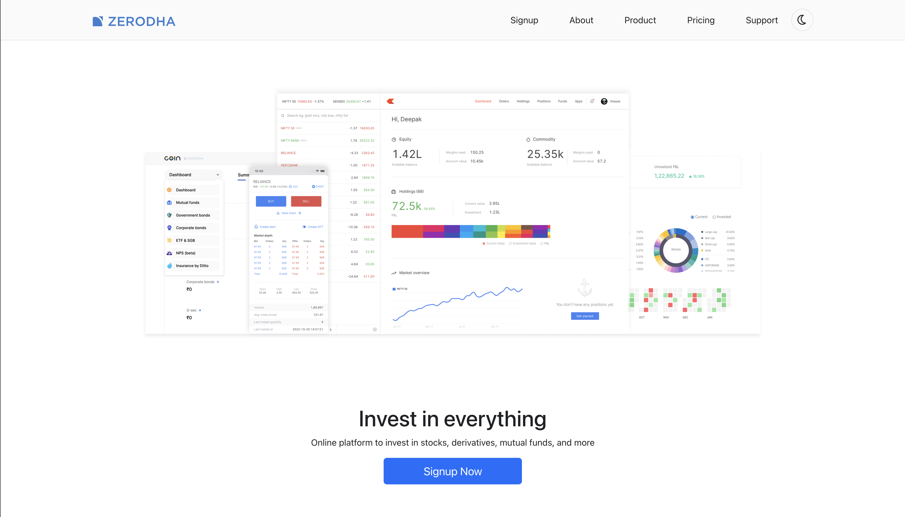
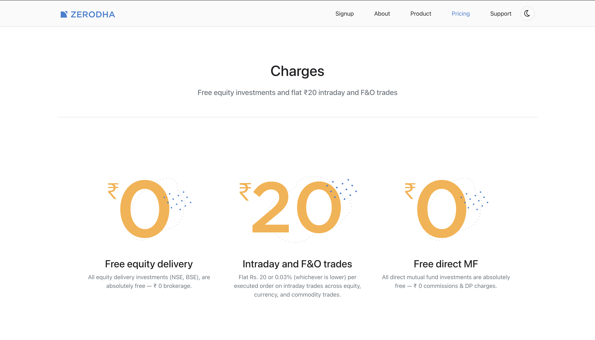
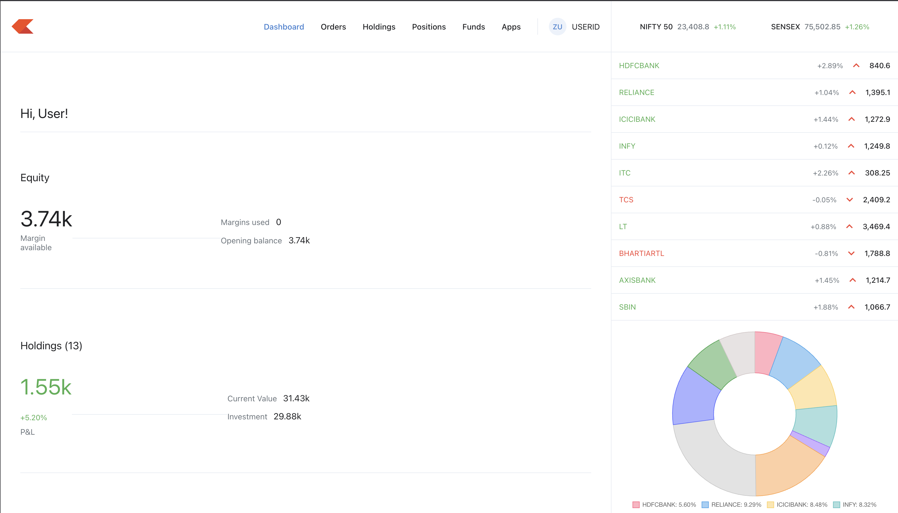
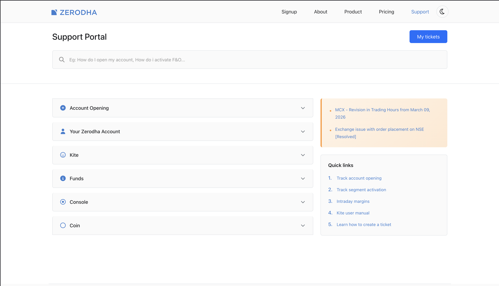

# Zerodha Clone

A Zerodha-inspired trading platform clone built as a full-stack learning project. Three independently-runnable apps share one MongoDB database.

## Screenshots

| Homepage | Sign Up | Pricing |
|---|---|---|
|  |  |  |

| Dashboard | Holdings | Support |
|---|---|---|
|  |  |  |

## Tech Stack

| Layer | Tech |
|---|---|
| Frontend | React, React Router, Bootstrap 5 (CDN) |
| Dashboard | React, React Router, MUI, Chart.js, Axios |
| Backend | Node.js, Express, Mongoose |
| Database | MongoDB |
| Live Prices | Yahoo Finance (`yahoo-finance2`) via proxy server |

## System Architecture

```
frontend (React, port 3000)
    └── calls backend (port 3002) via REACT_APP_BACKEND_URL

dashboard (React, port 3000 in dev)
    ├── calls backend (port 3002) for holdings, positions, orders
    └── calls proxy server (port 3001) for live NSE/BSE stock prices

proxy server (Express, port 3001) — dashboard/server.js
    └── wraps Yahoo Finance for Indian stock quotes

backend (Express, port 3002)
    └── MongoDB via Mongoose
```

## Features

- Live NSE/BSE stock price watchlist (polls every 15 seconds via Yahoo Finance proxy)
- Holdings and positions portfolio view with P&L calculations
- Order placement simulation (BUY/SELL with weighted average price tracking)
- Order history
- Market index display (Nifty 50, Sensex)
- Public marketing/landing pages (home, about, pricing, product, support, sign up)
- Dark mode support across both apps

## Folder Structure

```
zerodha-clone/
├── backend/               # Express REST API (port 3002)
│   ├── index.js           # All routes — single file, no router layer
│   ├── model/             # Mongoose models (HoldingsModel, PositionsModel, OrdersModel)
│   ├── schemas/           # Mongoose schema definitions
│   ├── seedHoldings.js    # Reset + reseed holdings collection
│   └── seedPositions.js   # Reset + reseed positions collection
│
├── frontend/              # Public/marketing React app (port 3000)
│   └── src/
│       ├── index.js       # App entry — AppLayout with theme management
│       ├── config.js      # BACKEND_URL, DASHBOARD_URL
│       └── landing_page/  # Page components (home, about, pricing, product, support, signup)
│
├── dashboard/             # Trading dashboard (port 3000) + proxy server (port 3001)
│   ├── server.js          # Express proxy for Yahoo Finance
│   └── src/
│       ├── index.js       # Dashboard entry
│       ├── config.js      # BACKEND_URL, PROXY_URL
│       ├── components/    # Dashboard UI components
│       └── hooks/         # useApiData custom hook
│
└── assets/                # README screenshots
```

## Installation & Setup

### Prerequisites

- Node.js 18+
- npm
- MongoDB (local or Atlas)

### Clone & Install

```bash
git clone https://github.com/SidVaidya2005/Zerodha_Clone.git
cd Zerodha_Clone

cd backend && npm install
cd ../frontend && npm install
cd ../dashboard && npm install
```

### Environment Variables

**`backend/.env`**
```env
PORT=3002
MONGO_URL=your_mongodb_connection_string
NODE_ENV=development
```

**`frontend/.env.local`**
```env
REACT_APP_BACKEND_URL=http://localhost:3002
REACT_APP_DASHBOARD_URL=http://localhost:3001
```

**`dashboard/.env.local`**
```env
REACT_APP_BACKEND_URL=http://localhost:3002
REACT_APP_PROXY_URL=http://localhost:3001
```

### Run

Each app runs in its own terminal:

```bash
# Terminal 1 — Backend API
cd backend && npm run dev

# Terminal 2 — Frontend marketing site
cd frontend && npm start

# Terminal 3 — Dashboard + proxy server (both start together)
cd dashboard && npm run dev
```

### Seed the Database

```bash
cd backend
npm run seed:holdings   # wipe + reseed holdings
npm run seed:positions  # wipe + reseed positions
```

## API Endpoints

| Method | Endpoint | Description |
|---|---|---|
| GET | `/allHoldings` | All holdings |
| GET | `/allPositions` | All positions |
| GET | `/allOrders` | All orders, newest first |
| POST | `/newOrder` | Place a BUY or SELL order |

### Proxy Server Endpoints (port 3001)

| Method | Endpoint | Description |
|---|---|---|
| GET | `/api/indian-stocks?symbols=TCS,INFY` | Batch NSE/BSE quotes |
| GET | `/api/indices` | Nifty 50 and Sensex |
| GET | `/api/market-status` | NSE open/closed status |

## Future Improvements

- User authentication and protected routes
- Real-time prices via WebSockets
- Watchlist CRUD with reorder support
- Order history filters, sorting, and pagination
- Advanced charting workspace
- CSV/PDF export
- PWA/mobile improvements

## Author

- GitHub: [@SidVaidya2005](https://github.com/SidVaidya2005)
