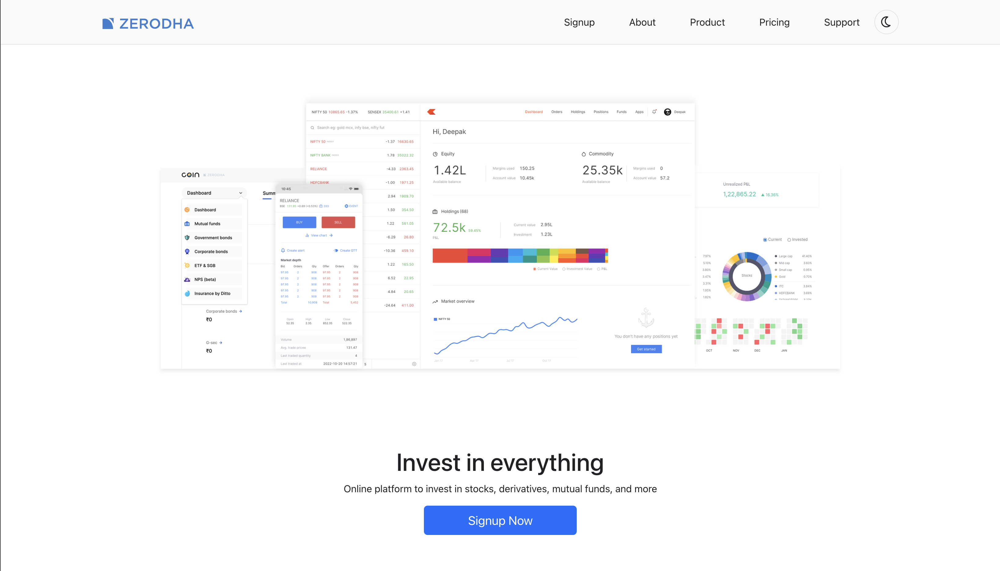
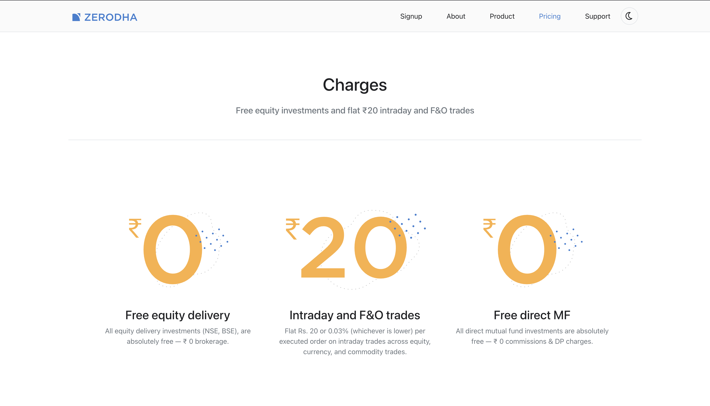
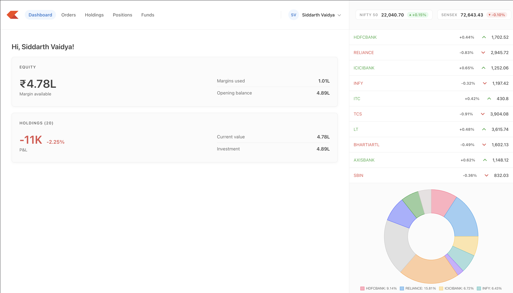
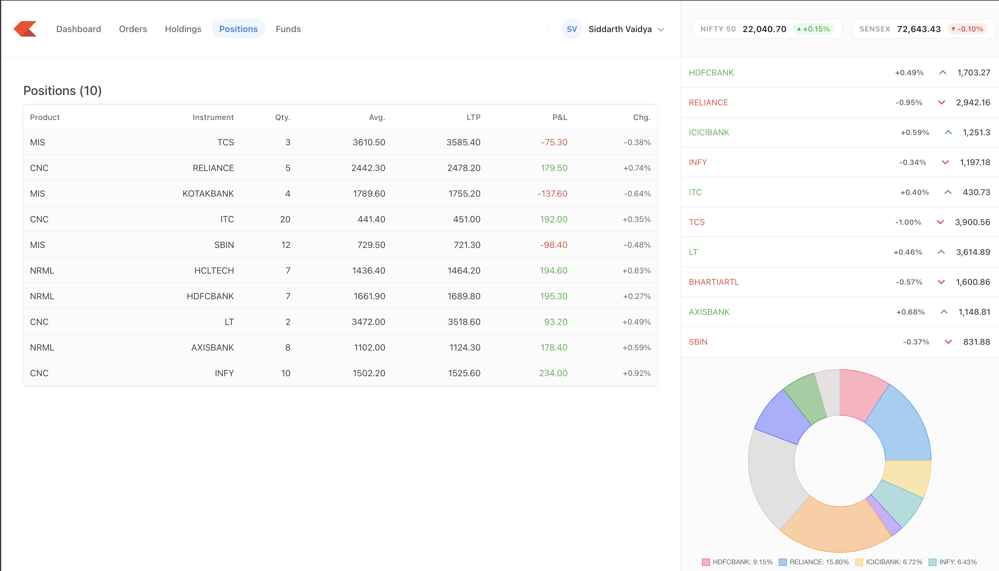
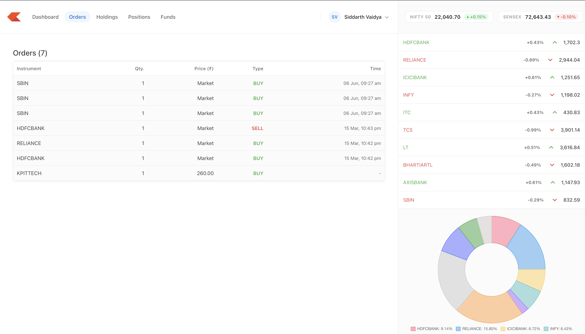
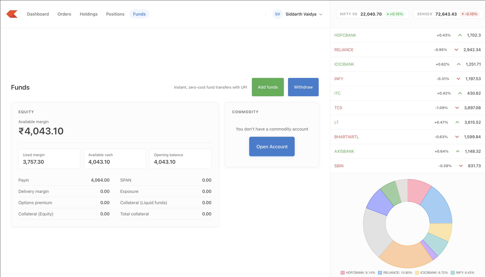
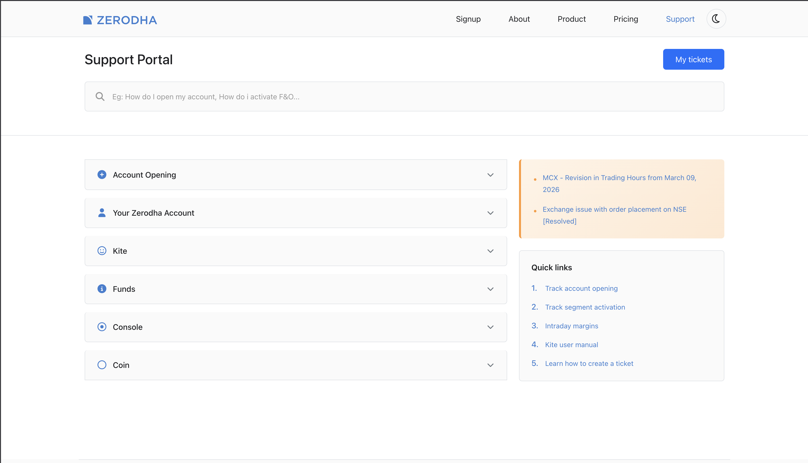

# Zerodha Clone

[](https://github.com/SidVaidya2005/ZerodhaRebuild/actions/workflows/ci.yml)
[](https://github.com/SidVaidya2005/ZerodhaRebuild/actions/workflows/codeql.yml)
[](LICENSE)

A Zerodha-inspired trading platform clone, built as a full-stack learning project. Three apps run independently against one shared MongoDB database.

## Screenshots

















## Tech stack

| Layer       | Tech                                                    |
| ----------- | ------------------------------------------------------- |
| Frontend    | React 18, React Router 6, Bootstrap 5 (CDN)             |
| Dashboard   | React 18, React Router 6, MUI 5, Chart.js, Axios        |
| Backend     | Node.js 20, Express 4, Mongoose, bcryptjs, jsonwebtoken |
| Database    | MongoDB                                                 |
| Live prices | `yahoo-finance2` via Express proxy server               |

## Architecture

```
frontend (React, port 3000)
    └── calls backend (port 3002)

dashboard (React, port 3004)
    ├── calls backend (port 3002) for holdings, positions, orders
    └── calls proxy server (port 3001) for live NSE/BSE prices

proxy server (Express, port 3001) at dashboard/server.js
    └── wraps yahoo-finance2 for Indian stock quotes

backend (Express, port 3002)
    └── routes → controllers → services → MongoDB (Mongoose)
```

## Features

- Live NSE/BSE stock price watchlist, updated every 15 seconds via the Yahoo Finance proxy
- Holdings and positions portfolio view with P&L calculations
- BUY/SELL order simulation with weighted average price tracking
- Order history
- Nifty 50 and Sensex index display
- Cookie-based JWT authentication (signup, login, logout)
- Dark mode across all three apps
- Public marketing pages: home, about, pricing, products, support

## Installation

**Prerequisites:** Node.js 20+, npm, MongoDB (local or Atlas)

```bash
git clone https://github.com/SidVaidya2005/ZerodhaRebuild.git
cd ZerodhaRebuild

# Install the shared ESLint config (required before per-app installs)
npm install

cd backend && npm install
cd ../frontend && npm install
cd ../dashboard && npm install
```

### Environment variables

**`backend/.env`**

```env
PORT=3002
MONGO_URL=your_mongodb_connection_string
NODE_ENV=development
JWT_SECRET=        # required; generate with: openssl rand -hex 32
FRONTEND_URL=http://localhost:3000
DASHBOARD_URL=http://localhost:3004
```

`JWT_SECRET` is required; the auth service throws if it's unset. `FRONTEND_URL` and `DASHBOARD_URL` form the CORS allowlist for credentialed cookie requests.

**`frontend/.env.local`**

```env
REACT_APP_BACKEND_URL=http://localhost:3002
REACT_APP_DASHBOARD_URL=http://localhost:3004
```

**`dashboard/.env.local`**

```env
REACT_APP_BACKEND_URL=http://localhost:3002
REACT_APP_PROXY_URL=http://localhost:3001
REACT_APP_FRONTEND_URL=http://localhost:3000
```

`REACT_APP_FRONTEND_URL` is required in the dashboard. It's where unauthenticated users get redirected, so an empty value silently breaks the auth gate.

## Running

Each app runs in a separate terminal from its own directory:

```bash
# Terminal 1
cd backend && npm run dev

# Terminal 2
cd frontend && npm start

# Terminal 3 — starts the React dashboard and proxy server together
cd dashboard && npm run dev
```

## Seeding the database

```bash
cd backend
npm run seed:holdings   # wipe + reseed holdings
npm run seed:positions  # wipe + reseed positions
```

Both scripts delete all existing records before inserting. Don't run them against a production database.

## API

### Backend (port 3002)

| Method | Endpoint        | Description                           |
| ------ | --------------- | ------------------------------------- |
| GET    | `/allHoldings`  | All holdings                          |
| GET    | `/allPositions` | All positions                         |
| GET    | `/allOrders`    | All orders, newest first              |
| POST   | `/newOrder`     | Place a BUY or SELL order             |
| POST   | `/signup`       | Create an account, sets `auth` cookie |
| POST   | `/login`        | Authenticate, sets `auth` cookie      |
| GET    | `/me`           | Current user (requires `auth` cookie) |
| POST   | `/logout`       | Clear the `auth` cookie               |

### Proxy server (port 3001)

| Method | Endpoint                              | Description            |
| ------ | ------------------------------------- | ---------------------- |
| GET    | `/api/indian-stocks?symbols=TCS,INFY` | Batch NSE/BSE quotes   |
| GET    | `/api/indices`                        | Nifty 50 and Sensex    |
| GET    | `/api/market-status`                  | NSE open/closed status |

## Tests and linting

Run the tests per app:

```bash
cd backend  && npm test   # Jest + supertest against in-memory MongoDB
cd frontend && npm test   # React Testing Library
cd dashboard && npm test  # React Testing Library
```

Backend tests use `mongodb-memory-server`, so no real database is required.

Lint and format checks mirror what CI enforces:

```bash
cd backend  && npm run lint && npm run format:check
cd frontend && npm run lint && npm run format:check
cd dashboard && npm run lint && npm run format:check
```

CI runs lint, format check, tests, and a production build on every push and pull request to `main`.

## Project structure

```
ZerodhaRebuild/
├── backend/               # Express REST API (port 3002)
│   ├── index.js           # Process startup: dotenv, mongoose connect, app.listen
│   ├── app.js             # buildApp(): Express, CORS, routes (test seam)
│   ├── routes/            # Path-to-controller mapping, one file per resource
│   ├── controllers/       # Input parsing, service calls, response formatting
│   ├── services/          # Multi-collection mutations (orderService, authService, …)
│   ├── middleware/        # requireAuth (JWT cookie verification)
│   ├── model/             # Mongoose models
│   ├── schemas/           # Mongoose schema definitions
│   ├── seed/              # seedHoldings.js, seedPositions.js
│   └── tests/             # Jest + supertest specs
│
├── frontend/              # Marketing React app (port 3000)
│   └── src/
│       ├── landing_page/  # Pages: home, about, pricing, products, support, auth
│       ├── data/          # Hardcoded content arrays (navItems, footerLinks, …)
│       └── styles/        # CSS split: tokens, layout, components, utilities
│
├── dashboard/             # Trading dashboard (port 3004) + proxy server (port 3001)
│   ├── server.js          # Express proxy for Yahoo Finance
│   └── src/
│       ├── layout/        # Home, TopBar, Menu, Dashboard (frame chrome)
│       ├── pages/         # Summary, Holdings, Positions, Orders, Funds
│       ├── widgets/       # WatchList (WatchList, WatchListItem, WatchListActions, AnalyticsModal)
│       ├── modals/        # BuyActionWindow
│       ├── charts/        # DoughnutChart, BarChart
│       ├── hooks/         # All side effects: polling, API calls, order submission
│       ├── context/       # BuyWindowContext, UserContext (auth gate)
│       ├── utils/         # portfolioUtils (pure math)
│       └── data/          # watchlistSymbols, chartPalette
│
├── shared/tokens.css      # Canonical design tokens (byte-identical copies in each app's src/styles/)
└── package.json           # Root devDependencies: shared ESLint config
```

## Contributing

See [CONTRIBUTING.md](CONTRIBUTING.md). Report security issues per [SECURITY.md](SECURITY.md); don't file them as public issues.

## License

MIT. See [LICENSE](LICENSE).
